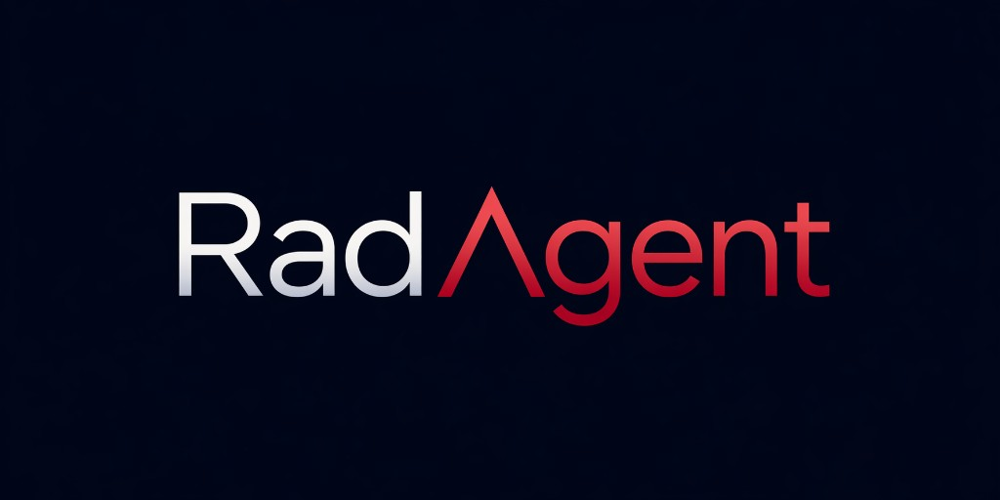

<p align="center">
  
</p>

# RadAgent: A Tool-Using AI Agent for Stepwise Interpretation of Chest Computed Tomography

<p align="center">
  <a href="https://arxiv.org/abs/2604.15231" target="_blank"></a>
  <a href="https://rad-agent.github.io/" target="_blank"></a>
  <a href="https://huggingface.co/RadAgent/radagent-qwen3-14b-lora" target="_blank"></a>
  <a href="https://huggingface.co/RadAgent" target="_blank"></a>
  <a href="https://github.com/eth-medical-ai-lab/rad-agent" target="_blank"></a>
</p>

### News

* **[2026]** We release **RadAgent**. Code will be released soon.

### Citation

```bibtex
@misc{roschewitz2026radagenttoolusingaiagent,
      title={RadAgent: A tool-using AI agent for stepwise interpretation of chest computed tomography}, 
      author={Mélanie Roschewitz and Kenneth Styppa and Yitian Tao and Jiwoong Sohn and Jean-Benoit Delbrouck and Benjamin Gundersen and Nicolas Deperrois and Christian Bluethgen and Julia Vogt and Bjoern Menze and Farhad Nooralahzadeh and Michael Krauthammer and Michael Moor},
      year={2026},
      eprint={2604.15231},
      archivePrefix={arXiv},
      primaryClass={cs.AI},
      url={https://arxiv.org/abs/2604.15231}, 
}
```
